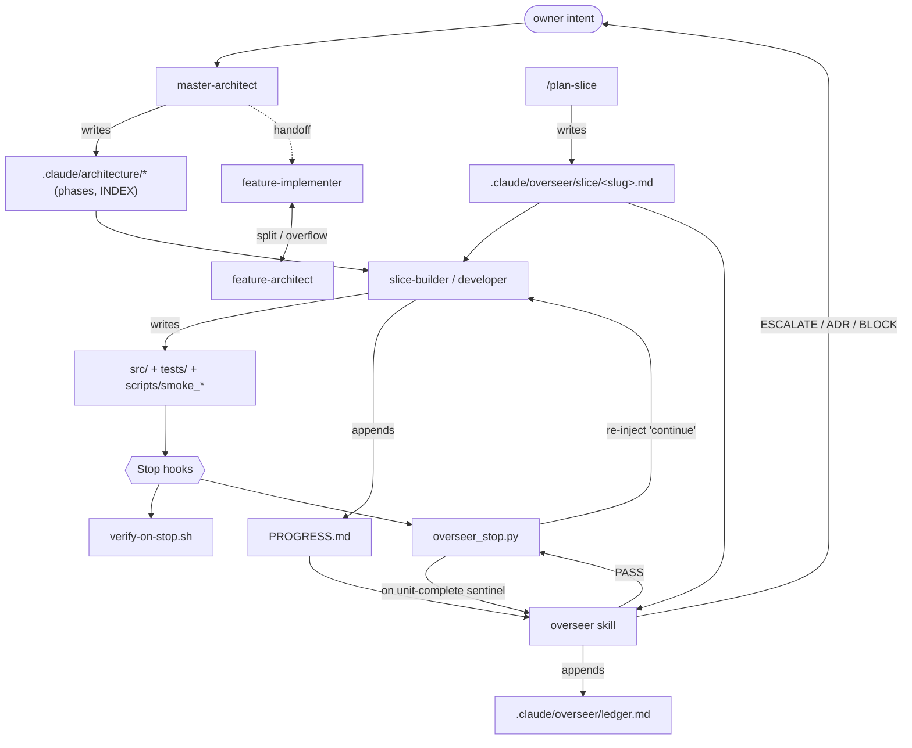
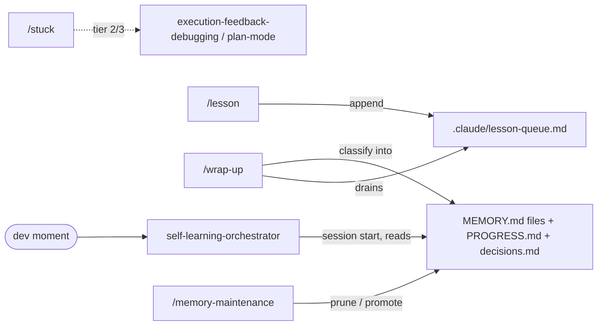
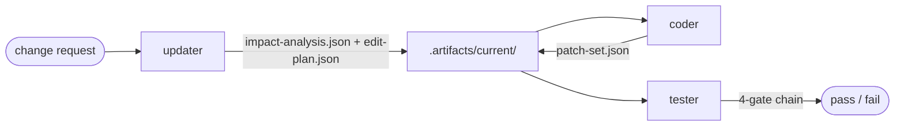

# Belegmeister agentic system — map & integration guide

This is the **map** of the agentic system that operates on this repo: which
agent produces which artifact, who consumes it, and who hands off to whom.
Read it before adding a new agent — it shows where a new part fits and what
communication contract it must honour.

This file **maps**; it is not the source of truth for any agent's behaviour.
Each agent's behaviour lives in its own definition (see
[§7 Where definitions live](#7-where-the-definitions-live)). When this map and
a definition disagree, the definition wins — and this map is stale and should
be fixed.

**Tag legend:** `[project]` = defined inside this repo's `.claude/`.
`[global]` = defined in `~/.claude/` (shared across all projects; can change
outside this repo — see [§5](#5-path-reconciliation-important)).

---

## 1. The 30-second model

Agents communicate through **files (artifacts), never through chat**. There are
four cooperating layers:

| Layer | What it does | Lives in |
|---|---|---|
| **Design** | Turns intent into a task/slice plan | `.claude/architecture/`, `.claude/overseer/slice/` |
| **Build** | Writes code + tests under TDD | `src/`, `tests/`, `scripts/` |
| **Enforce** | Hooks + overseer keep discipline | `.claude/hooks/`, `.claude/overseer/` |
| **Remember** | Distils lessons across sessions | `PROGRESS.md`, memory files, `.claude/lesson-queue.md` |

Two distinct build pipelines exist (a builder must know which one they extend):

1. **Slice flow (active here).** `master-architect` (design) → `slice-builder` /
   the developer agent (build) → `overseer` (audit). Plans live in
   `.claude/overseer/slice/<slug>.md`; history in `PROGRESS.md`.
2. **Controlled-Software-Evolution flow (declared, dormant here).**
   `updater` → `coder` → `tester`, communicating via JSON in
   `.artifacts/current/`. Declared in global `~/.claude/CLAUDE.md` but **not yet
   exercised in this repo** (`.artifacts/` does not exist until first use).

---

## 2. Component catalog

| Component | Tag | Kind | One-line role |
|---|---|---|---|
| `master-architect` | `[global]` | skill | 5-phase design → `tasks.yaml` handoff |
| `feature-architect` | `[global]` | skill | Splits an oversized task into a DAG of sub-tasks |
| `feature-implementer` | `[global]` | skill | Implements one `tasks.yaml` task under strict TDD |
| `slice-builder` | `[global]` | skill | Builds one thin vertical slice (seam-first TDD) |
| `self-learning-orchestrator` | `[global]` | skill | Dispatches the memory lifecycle at each dev moment |
| `documentation` | `[global]` | skill | Maintains AGENTS.md / ADRs / `docs/` (this guide's skill) |
| `claude-autonomy` | `[global]` | skill | One-time config of `settings.json` + the 6 hooks |
| `updater` | `[global]` | subagent | Pre-change ImpactAnalysis + EditPlan allowlist |
| `coder` | `[global]` | subagent | Implements only EditPlan-allowlisted files |
| `tester` | `[global]` | subagent | Runs the 4-gate chain; adversarial review |
| `overseer` | `[project]` | skill | 12-check discipline audit of the last turn |
| `plan-slice` | `[project]` | command | Writes a slice contract before implementation |
| `/lesson` `/wrap-up` `/stuck` `/memory-maintenance` | `[global]` | commands | Memory-lifecycle entry points |
| 6 hooks | `[project]` | hooks | Enforcement (see [§4](#4-the-enforcement-layer-hooks)) |

---

## 3. Artifact catalog — who writes, who reads

Paths are **this repo's** locations. The `lifetime` column tells a builder how
volatile the artifact is.

| Artifact (this repo) | Producer(s) | Consumer(s) | Lifetime |
|---|---|---|---|
| `.claude/architecture/INDEX.md` | `master-architect` | architect, humans | per phase |
| `.claude/architecture/phase-0-brief.md`, `phase-1-system.md` | `master-architect` | `feature-implementer`, `slice-builder` (context) | append/superseded |
| `.claude/architecture/phase-2..4*`, `tasks.yaml` | `master-architect`, `feature-architect` | `feature-implementer` | **not yet created** (phases PENDING) |
| `.claude/architecture/PROGRESS.md` | `master-architect` | architect (resume) | per session |
| `.claude/overseer/slice/<slug>.md` | `plan-slice`, developer | `overseer` (load-bearing), developer | per slice |
| `.claude/overseer/ledger.md` | `overseer` | `overseer` (counts PASS streak) | append-only |
| `.claude/overseer/MEMORY.md` | `overseer` | `overseer` | cross-slice, cited-or-pruned |
| `.claude/overseer/audit.md` | `overseer` | humans (ratify V2 checks) | append-only |
| `.claude/overseer/escalations.md` | humans | `overseer` | append-only |
| `.claude/overseer/state` | (manual / planning) | `overseer_stop.py` (phase guard) | ephemeral |
| `.claude/overseer/.last_audit_sha`, `.last_continue_sha` | `overseer_stop.py` | `overseer_stop.py` (recursion guard) | ephemeral |
| `.claude/artifacts/spikes/*` | developer, smoke/probe scripts | `PROGRESS.md`, ADRs | dated, kept |
| `.claude/artifacts/notes-during-session.md` | developer | developer | scratch |
| `PROGRESS.md` (root) | `slice-builder`, developer | `overseer`, `self-learning-orchestrator`, humans | append-only |
| `CLAUDE.md` (root) | `claude-autonomy`, `documentation`, `self-learning-orchestrator` (rare, confirmed) | **every agent** (always loaded) | rare |
| `AGENTS.md` (root) | `documentation` | every agent (via `@AGENTS.md`) | with code changes |
| `docs/adr/NNNN-*.md` | `documentation`, `master-architect`, developer | every agent, humans | **append-only / supersede** |
| `.claude/settings.json` + 6 hooks | `claude-autonomy` | Claude Code harness (session start) | rare |
| `.claude/lesson-queue.md` | `/lesson`, developer | `/wrap-up` (session-end) | drained per session |
| `~/.claude/memory/<tech>/MEMORY.md` `[global]` | `self-learning-orchestrator`, `feature-implementer` | all (session start) | per session-end |
| `decisions.md`, `claude-progress.md`, `<task>/reflections.md` | `self-learning-orchestrator`, `feature-implementer` | same | **not present yet** (created on demand) |
| `.artifacts/current/impact-analysis.json`, `edit-plan.json` | `updater` | `coder` | **dormant** (created on first CSE run) |
| `.artifacts/current/patch-set.json` | `coder` | `tester` | **dormant** |
| `.artifacts/code-map.json` | `updater` | `updater` | **dormant** |

---

## 4. The enforcement layer (hooks)

All 6 are `[project]`, produced by `claude-autonomy`, wired in
`.claude/settings.json`. They are the harness-executed guardrails every agent
runs inside.

| Hook | Event | Gates / effect | Artifacts touched |
|---|---|---|---|
| `block-dangerous.sh` | PreToolUse `Bash` | Blocks destructive patterns **and `git commit`** | — |
| `protect-paths.sh` | PreToolUse `Edit/Write/MultiEdit` | Blocks `.env`, `secrets/`, `migrations/`, `.git/`, workflows | — |
| `format-on-edit.sh` | PostToolUse `Edit/Write/MultiEdit` | `ruff format` + import-sort on `.py` | edited `.py` |
| `verify-on-stop.sh` | Stop | `ruff` + `mypy` + `pytest` on changed Python; blocks turn on fail | — |
| `overseer_stop.py` | Stop | Triggers the overseer audit on a unit-completion claim | reads/writes `.claude/overseer/{state,.last_*_sha}` |
| `auto-approve-web.py` | PreToolUse / PermissionRequest `WebFetch/WebSearch` | Auto-approves read-only web access | — |

The **Fast/Scope/Contract/Security** gate chain (global `~/.claude/CLAUDE.md`)
is what `tester` enforces in the dormant CSE flow; `verify-on-stop.sh` enforces
a subset (Fast gate) on every turn in the active flow.

---

## 5. Cooperation & dataflow

### Slice flow (active)

### Memory lifecycle (cross-cutting)

### Controlled-Software-Evolution flow (dormant — declared in global policy)

---

## 6. How to add a new agent

A new agent integrates by honouring the **artifact contract** above — not by
calling other agents directly. Checklist:

1. **Pick the layer** (design / build / enforce / remember) and which pipeline
   it extends (slice flow vs CSE flow). State it in the agent's own doc.
2. **Declare its artifacts.** List what it **produces** and **consumes** using
   the paths in [§3](#3-artifact-catalog--who-writes-who-reads). Reuse an
   existing artifact where possible; introduce a new one only if no existing
   contract fits. Prefer files under `.claude/` for this repo.
3. **Wire triggers & handoffs.** Decide what invokes it (user phrase, a hook,
   or another agent's handoff) and who it hands off to. If it joins the slice
   loop, it must respond to the overseer's `OVERSEER_PASS` → continue cycle and
   emit a halt marker (`OVERSEER_SLICE_AWAITING_OWNER:` etc.) when done.
4. **Respect the gates.** Anything that edits code passes
   `verify-on-stop.sh` (ruff + mypy + pytest) at turn end. Anything that joins
   the CSE flow passes the 4-gate chain via `tester` and stays within the
   `edit-plan.json` allowlist.
5. **Never commit.** `git commit` is hook-blocked; agents stage and report, the
   human commits.
6. **Register it.** A skill → `~/.claude/skills/<name>/SKILL.md` (or
   `.claude/skills/` if repo-local); a subagent → `~/.claude/agents/<name>.md`;
   a command → `.claude/commands/<name>.md`; a hook → `.claude/hooks/` **plus**
   an entry in `.claude/settings.json`.
7. **Update this map.** Add the component to [§2](#2-component-catalog) and its
   artifacts to [§3](#3-artifact-catalog--who-writes-who-reads). The change is
   not done until this guide reflects it.

---

## 7. Where the definitions live

This map points; it does not restate. For behaviour, read the source:

- Skills: `~/.claude/skills/<name>/SKILL.md` (global),
  `.claude/skills/overseer/SKILL.md` (project).
- Subagents: `~/.claude/agents/{coder,tester,updater}.md`.
- Commands: `~/.claude/commands/{lesson,wrap-up,stuck,memory-maintenance}.md`,
  `.claude/commands/plan-slice.md`.
- Hooks: `.claude/hooks/*` (wired in `.claude/settings.json`).
- Standing policy: `CLAUDE.md` + `AGENTS.md` (root); global
  `~/.claude/CLAUDE.md` (Controlled Software Evolution, the CSE flow + gates).

---

## 8. Path reconciliation (important)

Global skill files were written before this repo moved its agent dirs under
`.claude/`. They still say `.architecture/`, `.overseer/`, `artifacts/`, and
`.artifacts/current/` at the repo root. **In this repo the real locations are:**

| Global skill says | This repo uses |
|---|---|
| `.architecture/` | `.claude/architecture/` |
| `.overseer/` | `.claude/overseer/` |
| `artifacts/` | `.claude/artifacts/` |
| `.artifacts/current/` | unchanged (root) — dormant until first CSE run |

A new agent operating here must write to the **`.claude/` locations**. If a
global skill emits a root-level path, treat it as the `.claude/` equivalent.
