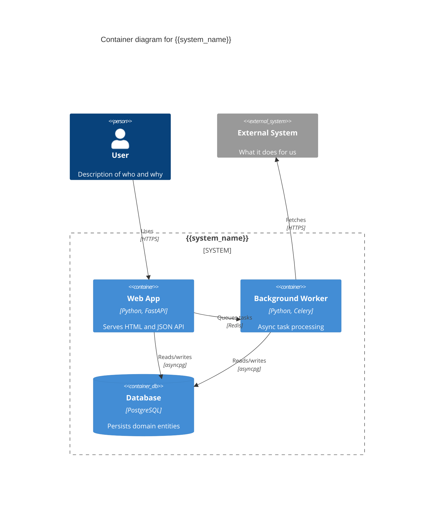
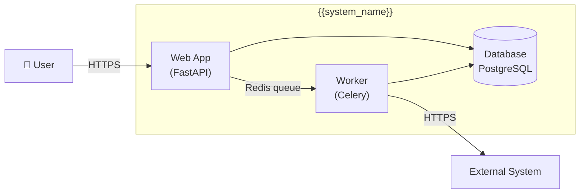
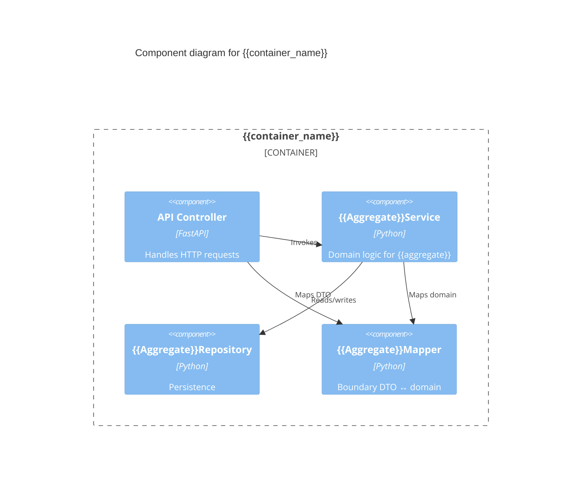

# C4 Diagrams with Mermaid

Reference for Phase 2 Container diagram generation and Phase 3 Component diagrams.

## What C4 is

Four levels of abstraction (Context → Container → Component → Code), each zoomed in:

- **C1 Context**: the system + external actors / external systems. One-page overview.
- **C2 Container**: the system internals: deployable/runnable units (containers in C4 sense, not Docker). Phase 2 deliverable.
- **C3 Component**: zoom into one container — its internal components. Phase 3 deliverable.
- **C4 Code**: class diagrams. Usually skipped or auto-generated.

Master-architect uses C1 implicitly in Phase 1 (system context section), C2 in Phase 2 (container diagram), C3 in Phase 3 (component-level layout).

## Mermaid C4 status

Mermaid supports C4 syntax (`C4Context`, `C4Container`, `C4Component`) but as of 2026 it's still flagged "experimental" in mermaid-js docs. Quirks:

- Some viewers don't render C4 syntax properly (especially older renderers, some IDE plugins)
- Layout is sometimes janky compared to specialized tools (Structurizr DSL, PlantUML C4)
- Edge labels can disappear if too long

**Recommendation**: always include a **flowchart fallback** for every C4 diagram. Mermaid `flowchart` renders everywhere.

## Container diagram template (Phase 2)



## Flowchart fallback (always include)



## Component diagram template (Phase 3)



## Common Mermaid pitfalls

1. **Quotes inside strings**: escape as `\"`. Special chars in labels (parens, brackets) often break rendering.
2. **Long edge labels**: keep under ~30 chars. Use line breaks (`<br/>`) sparingly.
3. **Cycles in C4 layouts**: Mermaid's layout for C4 doesn't always handle cycles well. Workaround: use flowchart with explicit direction (`TB`/`LR`/`BT`/`RL`).
4. **Database shape**: Mermaid C4 has `ContainerDb()`. Flowchart fallback uses `[("text")]` for cylinder. Don't conflate.
5. **External actors**: in C4 use `Person()` or `System_Ext()`. In flowchart, just use a different node shape or color.
6. **Boundaries**: in C4, `System_Boundary()` and `Container_Boundary()` are required for nesting. In flowchart, use `subgraph`.

## When to skip diagrams

- Trivial systems (≤3 containers): a Markdown bullet list might be enough
- Diagrams that don't add information beyond the text description
- Diagrams that change every week (high-churn early stage) — defer until they stabilize

## When to use a non-Mermaid tool

Mermaid is great for "version-controlled diagrams alongside code" workflow. Reach for specialized tools when:

- **Structurizr DSL** — when you have many diagrams that share entities (DRY); when you want to generate multiple views from one source
- **PlantUML C4** — when you need the most polished C4 rendering; mature plugin ecosystem
- **Draw.io / Excalidraw** — when free-form layout matters more than version control (whiteboarding, presentations)

For master-architect, prefer Mermaid — fits the "everything in `.architecture/`" model.

## Including diagrams in `.architecture/`

Embed in the relevant Markdown file (e.g., `phase-2-architecture.md`). Don't separate diagram files unless they're truly reused (rare in practice).

```markdown
## Container diagram

\`\`\`mermaid
C4Container
    ...
\`\`\`

(Fallback: same diagram in flowchart syntax)

\`\`\`mermaid
flowchart LR
    ...
\`\`\`
```

The double-render is slightly redundant for readers in good viewers but always works.

## Sources

- Simon Brown, *The C4 model for visualising software architecture* (c4model.com)
- Mermaid C4 docs: mermaid.js.org/syntax/c4.html
- Structurizr DSL: structurizr.com/dsl
